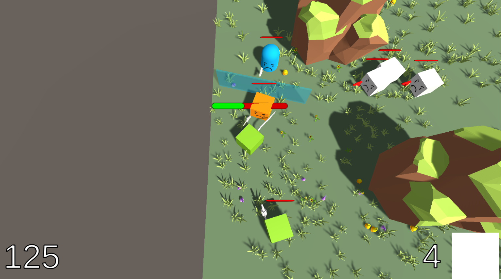
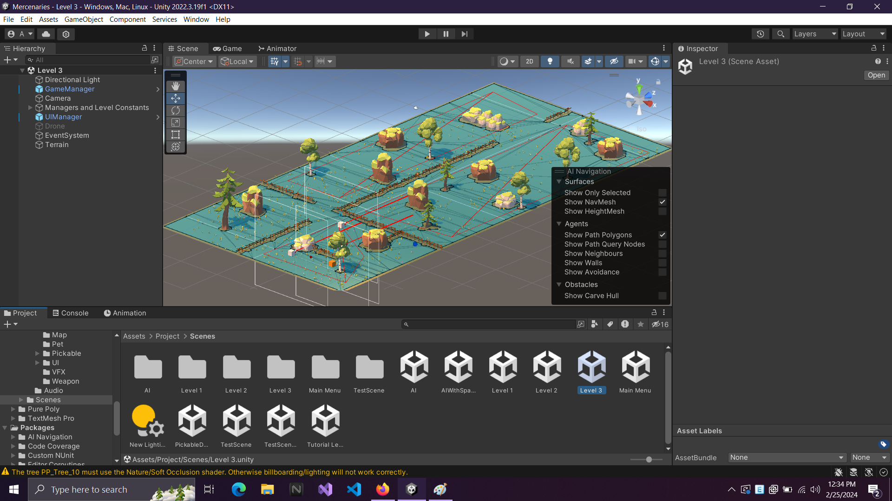
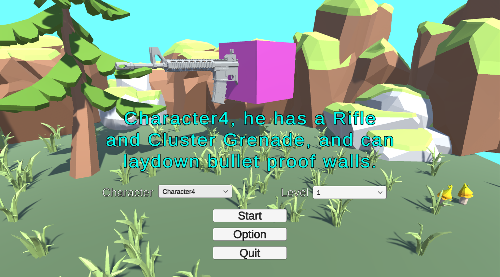
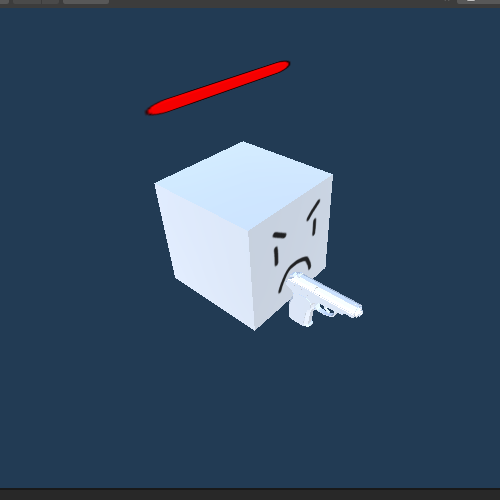
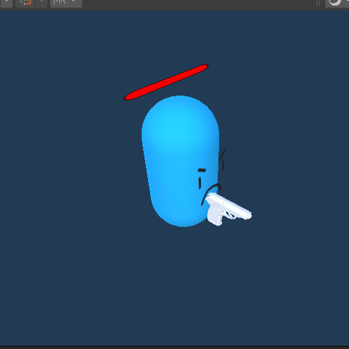
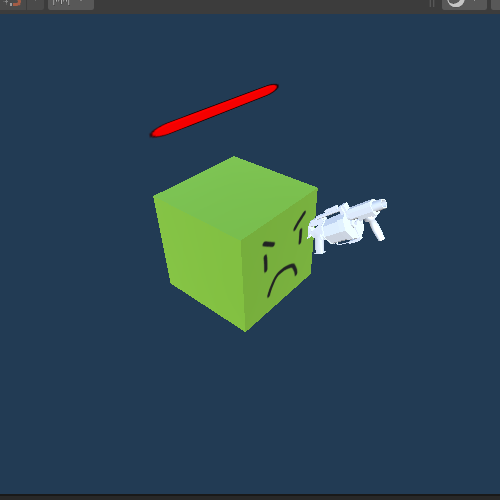
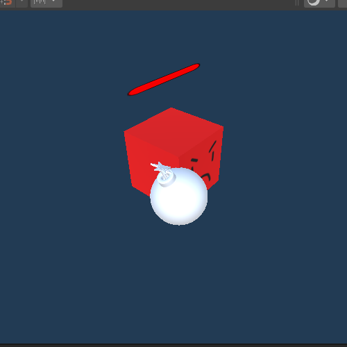
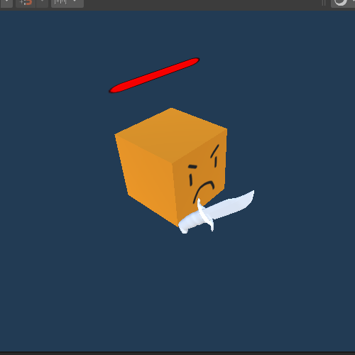
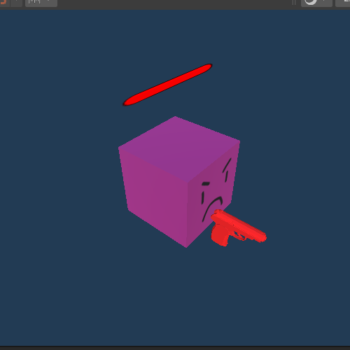

<!-- PROJECT LOGO -->
 

  

<h3 align="center">Project Mercenaries</h3>

  

    Một tựa game bắn súng góc nhìn trên xuống.
     
    <a href="https://www.youtube.com/watch?v=uiBxiij-B3E"><strong>Xem demo của game trên Youtube »</strong></a>
  

<!-- GETTING STARTED -->
## Cài đặt game
1. Tải game về từ https://drive.google.com/drive/u/2/folders/14qs6VcW_sd79_mG8EofwKg6uREHw32TJ
2. Giải nén.
3. Vào thư mục ProjectMercenaries chạy file Mercenaries.exe

Cách điều khiển nhân vật:

W, A, S, D: Di chuyển tương ứng lên, trái, xuống và phải.

Chuột trái: Bắn.

R: Kích hoạt kỹ năng.

Space: Lướt một đoạn ngắn.

(<a href="#readme-top">back to top</a>)

<!-- ABOUT THE PROJECT -->
## Về dự án

Lấy cảm hứng từ tựa game AlienShooter, project Mercenaries là một tựa game bắn súng ngắn góc nhìn trên xuống được tạo ra 2 sinh viên đại học Công Nghệ Thông Tin của DHQG Tp.HCM nhằm tìm hiểu và áp dụng công nghệ Unity3D.

(<a href="#readme-top">back to top</a>)

## Chi tiết màn chơi

Tại màn hình chính người chơi có thể lựa chọn đề bắt đầu 1 trong 3 màn chơi có sẵn, dồng thời chọn nhân vật mình mong muốn để bắt đầu trò chơi.

LƯU Ý: Nhân vật đầu tiên bất tử, chỉ sử dụng để tìm và sửa lỗi, không khuyến khích sử dụng.

### Các kẻ địch trong game
 

  
    Kẻ địch cơ bản của game. Lượng máu và sát thương tuy thấp nhưng số lượng rất đông và hung hãn.
     

  
    Kẻ địch này có khả năng tạo ra một chiếc khiên chống đạn ở trước mặt. Sát thương tuy yếu nhưng lại rất khó tiêu diệt.
     

  
    Kẻ địch này chỉ tấn công từ xa, lượng máu tuy thấp nhưng bù lại gây sát thương rất lớn, phải tiêu diệt sớm.
     

  
    Kẻ địch này sẽ phát nổ khi tiếp cận dược mục tiêu, tiêu diệt chính bản thân nó và gây sát thuong cho người chơi.
     

  
    Kẻ địch này chỉ có thể tấn công cận chiến, tốc độ di chuyển cực kỳ nhanh.
     

  
    Chỉ xuất hiện trong màn chơi thứ 2. Kẻ địch này có thể tiêu diệt người chơi trong nháy mắt nhưng chỉ thấy được người chơi đứng trong tầm nhìn của nó. Tránh xa bằng mọi giá.
     

